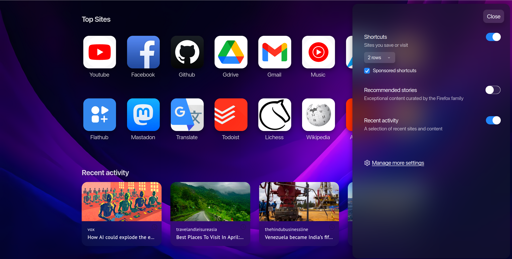
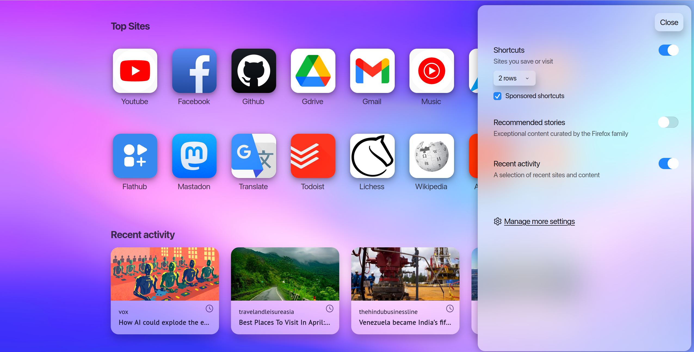

### Preface
There are a lot of beautiful Firefox themes available online, but few of them change the new tab significantly or even at all. Since I often use shortcuts on the new tab, it is important to me and I decided to create a design for the new tab. I did not change the browser theme globally, since there are many ready-made beautiful themes. You can also use this project in conjunction with other themes for Firefox (there may be bugs), then I will describe the installation process.

### Preview
##### Dark mode

##### Light mode

### Requirements!
The position of the `svg.context-properties.content.enabled` parameter in about:config must be `true`

To avoid problems with the font, the font must be installed in the browser - San Francisco.

### Installation
1.Download the archive from the releases and unpack it at `mozilla/firefox/firefox-profile-directory/chrome`

2.If you already have themes installed, simply add the following line to the `userContent.css` file: `@import url('newtab/new_tab.css');`
  
  If you are installing this theme for the first time, then download this file from releases and place it in the chrome folder

  and then enable `toolkit.legacyUserProfileCustomizations.stylesheets` in `about:config`
### Conclusion
This project was created for personal use, but if you liked it and would like to use it, but you have comments or suggestions, then you can open an issue and let me know about it, or you can simply fork this project and use it in your work.

Tested only on Linux!
